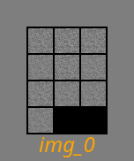
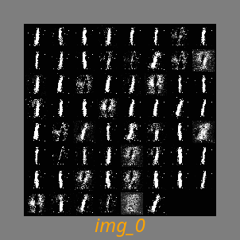
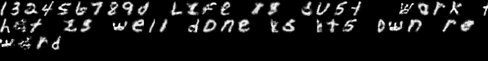
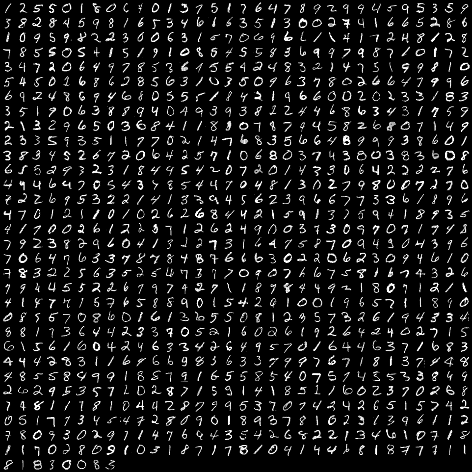
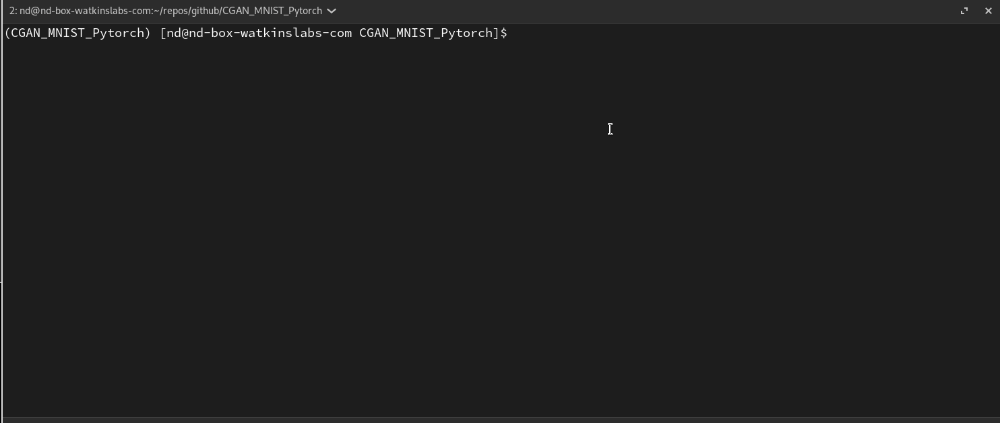

# glyphix

I embarked on this project over the weekend, inspired by the remarkable code shared by Amir Hossein Fouladi. My goal was to adapt it for command line application, showcasing a typical example of my collaboration with data scientists. I've refined and enhanced it significantly, yet the foundational code is a testament to Amir's original work. My sincere thanks to Amir!

This code exemplifies a CGAN deep learning model using PyTorch, short for Conditional Generative Adversarial Net. CGAN networks determine the class of generated images. The architecture comprises Multi-Layer Perceptron (MLP) networks for both generator and discriminator. Trained on the MNIST dataset, the model can generate images representing numbers 0 to 9 based on specified labels.

This project aims to showcase the transformation of a Jupyter notebook into an enjoyable commandline utility. Enhancements include:

## Features

- **MNIST/EMNIST**: Build on MNIST or EMNIST (numeric (10 classes) or alpha numeric (62 classes))
- **Command Line Utility Integration**: A seamless command line interface for easy access and control.
- **Model Persistence**: Functionality to save models for future use.
- **Checkpoint Resumption**: Ability to load models and resume from checkpoints.
- **Organized Model Directories**: Each model has its own dedicated directory.
- **Epoch Image Saving**: Saves images after each epoch for visual progress tracking.
- **Training Progress Logging**: Detailed logging of epochs and training metrics.
- **Configurable Runs**: Use configuration files to document and customize each run.
- **Progress Bar**: A visual progress bar to monitor process status.
- **Configurable Learning Rates**: Configurable learning rates for both the generator and discriminator to optimize training.
- **Multiple Optimizers**: Integration of different optimizers to enhance model performance (ongoing development).
- **CLI Ascii Art**: Snazzy TAAG Ascii art for an enhanced command line interface experience.
- **GIF Generation**: Handy tool for creating GIFs to visualize training progression.
aker

## Thoughts

After about 100 iterations, loss just loops for both models.. so I dont see a need for 800 iterations.
I would love to get this working better, please give feedback.

## Install

```bash
pipenv install
```

## Use

```bash
pipenv shell
usage: __main__.py [-h] [--model {MNIST,EMNIST}] [--output-dir OUTPUT_DIR] [--workers WORKERS] [--batch BATCH]
                   [--save-checkpoints] [--checkpoint-interval CHECKPOINT_INTERVAL] [--gen_model-path GEN_MODEL_PATH]
                   [--dis_model-path DIS_MODEL_PATH] [--epochs EPOCHS] [--optimizer {adam,rmsprop,sgd}]
                   [--gen-lr GEN_LR] [--dis-lr DIS_LR] [--config CONFIG]

Train a Conditional GAN on MNIST or EMNST data.

options:
  -h, --help            show this help message and exit
  --model {MNIST,EMNIST}
                        Dataset to use
  --output-dir OUTPUT_DIR
                        Directory to save all output_data
  --workers WORKERS     The number of threads for dataloaders
  --batch BATCH         The batch size for the dataloader
  --save-checkpoints    Flag to save model checkpoints.
  --checkpoint-interval CHECKPOINT_INTERVAL
                        Interval (in epochs) between saving model checkpoints.
  --gen_model-path GEN_MODEL_PATH
                        Path to the pre-trained generator model to load.
  --dis_model-path DIS_MODEL_PATH
                        Path to the pre-trained discriminator model to load.
  --epochs EPOCHS       Number of epochs to train the model.
  --optimizer {adam,rmsprop,sgd}
                        Optimizer for training: adam, rmsprop, or sgd.
  --gen-lr GEN_LR       Learning rate for the generator.
  --dis-lr DIS_LR       Learning rate for the discriminator.
  --config CONFIG       Path to a YAML configuration file.


python  -m cganMNIST --epochs=200 --optimizer=adam

```

## Make the gif

There is a gif maker script in the root of the project.

```bash
./ gif.sh ./output/20240311-144708/images.txt
```

## Timelapse





## Created from EMNIST trained model



## Sample data



## Cli action



## reference

The original source code for the Jupyter notebook

- Author: Amir Hossein Fouladi
- [Original Repository](https://github.com/Amir-Hofo/CGAN_MNIST_Pytorch/tree/main)
- [MNIST Data](https://www.kaggle.com/datasets/hojjatk/mnist-dataset)
- [EMNIST Data](https://www.nist.gov/itl/products-and-services/emnist-dataset)

## Thanks for all the project that I've used to get me here

- [alive_progress](https://github.com/rsalmei/alive-progress?tab=readme-ov-file)