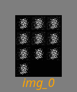

# CGAN_MNIST

This is a weekend project. I saw some great code by Amir Hossein Fouladi, and I thought to refgine it for command line usage. As an example project of how I normaly woprk with data scientists.  I'ce cleaned it up, and added a lot of shine.. but the core code was derrived from Amir's work. Thank you Amir!

This code exemplifies a CGAN deep learning model using PyTorch, short for Conditional Generative Adversarial Net. CGAN networks determine the class of generated images. The architecture comprises Multi-Layer Perceptron (MLP) networks for both generator and discriminator. Trained on the MNIST dataset, the model can generate images representing numbers 0 to 9 based on specified labels.

This project aims to showcase the transformation of a Jupyter notebook into an enjoyable commandline utility. Enhancements include:

- Integration of a command line utility
- Model saving functionality
- Loading models and resuming checkpoints
- Individual model directories
- Saving images per epoch
- Logging epochs and training progress
- Configuration files documenting each run
- Progress bar for tracking process status.
- added configurable learning rates for generator and discriminator
- added different optimisers (still working on that)
- snazzy TAAG AScii art for the CLI!
- handy gif maker

## Thoughts

After about 100 iterations, loss just loopps for both models.. so I dont see a need for 800 iterations.
I would love to get this working better, please give feedback.

## Install

```bash
pipenv install
```

## Use

```bash
pipenv shell
python -m cganMNIST -h
usage: cganMNIST [-h] [--output_dir OUTPUT_DIR] [--save_checkpoints] [--checkpoint_interval CHECKPOINT_INTERVAL]
                   [--gen_model_path GEN_MODEL_PATH] [--dis_model_path DIS_MODEL_PATH] [--epochs EPOCHS]
                   [--optimizer {adam,rmsprop,sgd}] [--gen_lr GEN_LR] [--dis_lr DIS_LR] [--config CONFIG]

Train a Conditional GAN on MNIST data.

options:
  -h, --help            show this help message and exit
  --output_dir OUTPUT_DIR
                        Directory to save all output_data
  --save_checkpoints    Flag to save model checkpoints.
  --checkpoint_interval CHECKPOINT_INTERVAL
                        Interval (in epochs) between saving model checkpoints.
  --gen_model_path GEN_MODEL_PATH
                        Path to the pre-trained generator model to load.
  --dis_model_path DIS_MODEL_PATH
                        Path to the pre-trained discriminator model to load.
  --epochs EPOCHS       Number of epochs to train the model.
  --optimizer {adam,rmsprop,sgd}
                        Optimizer for training: adam, rmsprop, or sgd.
  --gen_lr GEN_LR       Learning rate for the generator.
  --dis_lr DIS_LR       Learning rate for the discriminator.
  --config CONFIG       Path to a YAML configuration file.


python  -m cganMNIST --epochs=200 --optimizer=adam

```

## Make the gif

There is a gif maker script in the root of the project.
```bash
./ gif.sh ./output/20240311-144708/images.txt
```

## Timelapse



## reference

The source code for the juytpter notebook

- Author: Amir Hossein Fouladi
- [Original Repository](https://github.com/Amir-Hofo/CGAN_MNIST_Pytorch/tree/main)

## Thanks for all the project that I've used to get me here

- [alive_progress](https://github.com/rsalmei/alive-progress?tab=readme-ov-file)